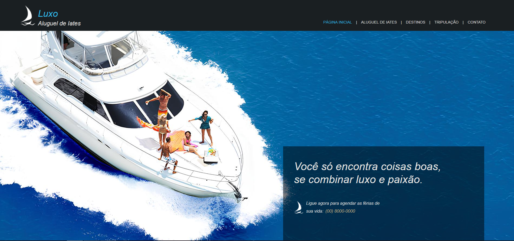

# ⛵ Luxo Aluguel de Iates — Site Estático com HTML e CSS

Este é um projeto de site estático desenvolvido com **HTML5** e **CSS3**, simulando a página principal de uma empresa fictícia de aluguel de iates de luxo. O site tem foco em design visual, estrutura semântica e responsividade básica.

---

## 🎯 Objetivo

Treinar estruturação de layout, organização de navegação, estilização com CSS e criação de uma interface amigável, usando apenas tecnologias puras da web (sem JavaScript).

---

## 🖥️ Funcionalidades

- Menu de navegação fixo e estilizado
- Banner com frase de impacto
- Seções de destinos e frota com imagens
- Rodapé com direitos autorais
- Estilo visual limpo e elegante, com paleta de cores harmônica

---

## 🧱 Tecnologias Usadas

- HTML5
- CSS3 (embutido via `<style>` no HTML)
- Design responsivo básico
- Posicionamento com `flexbox`

---

## 📷 Prévia



---

## 📂 Estrutura do Projeto

```text
.
├── index.html
├── barco1.png
├── barcoprincipal.jpg
├── barcodestino.jpg
├── barconossafrota1.jpg
├── barconossafrota2.jpg
├── destino.png
└── nossafrota.png
```
---
## 🚀 Como Visualizar

  1. Clone o repositório:

    git clone https://github.com/seu-usuario/luxo-aluguel-iates.git

  2.Abra o arquivo index.html em qualquer navegador:

      cd luxo-aluguel-iates
      start index.html  # No Windows

## 🙋‍♂️ Autor

  - Patryck Willyams
  - patryckwillyams@gmail.com
  - https://www.linkedin.com/in/patryck-willyams-90384017b/
      
